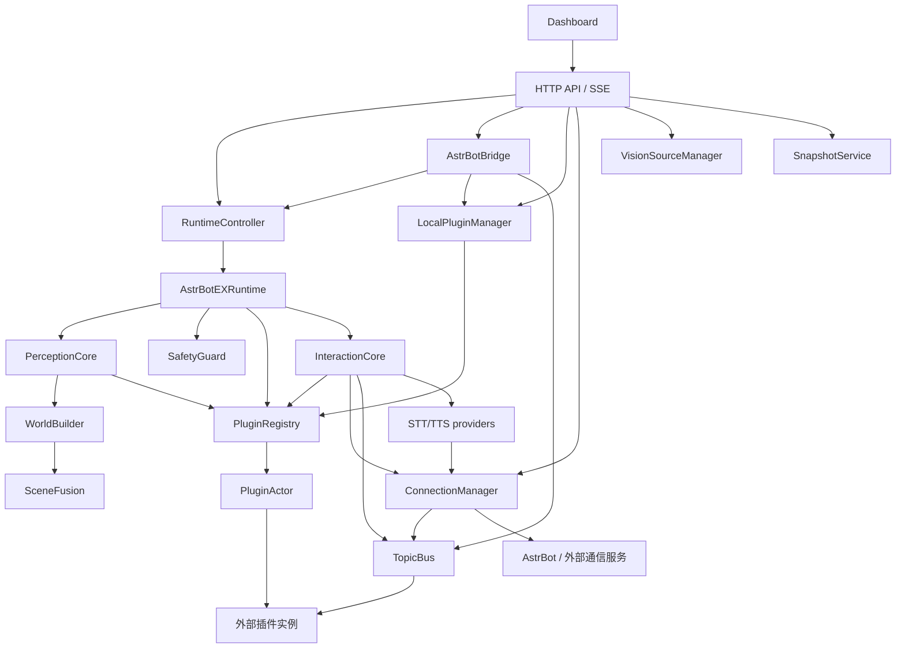

# AstrBotEX Architecture Review

审查日期：2026-09-16。代码基线：`4a199bb`（`feat: import existing AstrBotEX baseline`）。包版本：`0.1.0`。

分析范围仅为 `apps/AstrBotEX`。本文中的文件路径均相对于该目录，除非明确写出仓库根路径。外部 AstrBot、A.E.B、EXplugin、ROS 2 和 Isaac 项目未纳入代码审查。

## 1. 结论与现有能力

当前 AstrBotEX 已有可测试的本地运行时框架：HTTP API、Dashboard、插件加载与线程管理、感知融合、规则和技能调用、运动意图过滤、AstrBot 消息适配、语音交互以及实例快照。它具有连接真实系统的接口，但当前目录没有部署设备插件，也没有完整的机器人任务实现。

后续重构应先在现有 Python 包内划分职责，再提取外部适配器和插件目录服务。直接把 `core/` 按文件名分散到多个应用或 ROS package，会破坏动态插件导入、生命周期、资源路径和消息契约。

### 1.1 能力核对

| 能力 | 当前实现与证据 | 本次能够确认的边界 |
| --- | --- | --- |
| API 与运行状态 | `api_server.py`：HTTP 路由、运行控制器、SSE、静态资源服务 | 本地 API 框架已实现；旧 `/api/...` 与 `/api/v1/ex/...` 路径并存 |
| Dashboard | `dashboard/app.js`、`index.html`、`styles.css` | 有运行状态、插件、日志、语音、连接和快照页面；未做浏览器端验收 |
| 插件管理 | `local_plugins.py`、`plugin_registry.py`、`plugin_actor.py` | 有发现、ZIP 安装、配置、启停、卸载和单插件线程；当前目录没有 `plugins/` 实现集合 |
| 运行循环 | `runtime.py`、`test_runtime_actor_integration.py` | 能读取状态、更新感知、执行规则、选择一个目标和一个活动技能，再发送意图；真实行为依赖外部插件 |
| 感知融合 | `perception_core.py`、`scene_fusion.py`、`world_builder.py` | 已实现视觉框方位与激光距离的弱融合、障碍物聚类和降级标记；不包含图像推理模型 |
| 视觉源管理 | `vision_sources.py`、API 的 vision 路由 | 已实现 mock/HTTP 视觉结果查询和源配置；没有自动接入 runtime 的 vision 插件槽 |
| 运动安全过滤 | `safety.py`、`test_safety.py` | 已实现急停状态检查、非有限速度拒绝、速度与持续时间限幅；不能据此认定全系统或硬件安全 |
| AstrBot 动作提案 | `astrbot_bridge.py`、`test_astrbot_bridge.py` | 已实现上下文、动作目录、引用与参数检查、运行状态约束、主题分发；不直接调用 LLM |
| AstrBot 文本与音频 | `interaction_core.py`、`providers/astrbot_providers.py` | 已有文本请求、STT/TTS 代理、回复处理、轮次过滤和播放期间麦克风门控；需外部服务及设备插件 |
| ZeroMQ / WebSocket | `connection_manager.py` | 有客户端/服务端、连接持久化、消息队列与 AstrBotEX 请求响应协议；本环境缺库，3 项实际传输测试跳过 |
| 实例快照 | `backup.py`、`test_backup.py` | 已实现 profiles/plugins 的导出、校验、恢复与失败回滚；不等于 Git 源码备份 |
| ROS 2 | `scripts/lidar_scan_visualizer.py` | 存在独立激光可视化节点脚本；范围内没有 ROS package、runtime ROS bridge 或 ROS 接口定义 |
| 完整任务规划与重规划 | README 的项目定位、`runtime.py` 的策略/技能接口 | 有扩展位置；当前范围内未找到完整任务图、持久任务状态或自动触发 AstrBot 重规划的实现 |
| 真实 YOLO、CAN、机械臂、Isaac 仿真闭环 | README/TECHNICAL 的描述和外部项目引用 | 当前目录未提供这些可运行实现；不能按文档描述认定已经集成 |

### 1.2 文档与代码的差异

- `README.md:194` 附近描述 `plugins/`，并在 `README.md:211` 声称内置 YOLO 插件。当前 77 个文件中没有该目录或实现。
- `TECHNICAL.md:380` 附近列出 `plugins_state.json` 的样例启用插件。当前该文件不存在，且被本地 `.gitignore` 忽略。因此不能把样例当作当前部署状态。
- `TECHNICAL.md:6` 引用旧提交 `36c00a9`。本次基线是 `4a199bb`，旧文档未在本次更新正文。
- 文档中的“JSON Schema 校验”对应手写的部分校验逻辑，不能理解为完整 JSON Schema 实现。动作参数与插件配置的支持范围也不一致，详见第 5 节。
- `compose.yml` 使用可配置 AstrBot 镜像，默认是 `soulter/astrbot:latest`。该部署方式不自动使用主工程中的 AstrBot submodule 版本。

## 2. 扫描范围与方法

共盘点 77 个现有文件，包括隐藏配置文件。54 个为 Python 文件：35 个包内模块、17 个测试与测试辅助文件、2 个 Python 脚本。其余文件包括 3 个 Dashboard 文件、配置、部署脚本和说明文档。

对所有 Python 文件进行了 AST 解析、导入扫描和测试入口盘点。对核心调用链、动态加载、线程交互、API 路由、Dashboard 请求、配置和脚本入口进行了交叉核对。静态分析仅覆盖当前目录内可解析的导入；无法证明外部插件没有依赖现有导入路径。

本次执行了现有 unittest 测试，并对感知配置恢复的对象引用做了独立内存检查。未启动正式应用、设备、ROS 节点或容器。测试中的临时文件和回环 HTTP 服务由既有测试创建；没有使用真实项目数据目录进行恢复测试。

## 3. 当前模块地图

下图表示主要对象的装配和调用关系。箭头不全部等同于 Python import。



`EventBus` 为这些模块提供过滤后的诊断事件，并由 SSE 展示。`models.py` 为运行时、感知、安全和 interfaces 提供共同数据类型。两者作为公共依赖未在上图展开，避免遮蔽主链路。

### 3.1 一次 runtime tick

```text
RUNNING
  → 给有 on_tick 的插件投递可合并的异步调用，携带上一帧 world
  → motion 插件 read_state
  → vision.get_result / scan.get_scan
  → WorldBuilder → 可选 SceneFusion → 替换 runtime.world
  → rule.evaluate_world
  → policy.select_goal
  → 继续活动技能，或取消旧技能并选择第一个 can_run 的技能
  → skill.tick
  → SafetyGuard.filter_intent
  → rule.evaluate_intent
  → motion.send；没有 motion 插件则丢弃意图并发出诊断事件
  → done/failed 时清空活动技能
  → InteractionCore.tick（前面的提前返回会跳过此步骤）
```

语音主队列由独立 worker 处理，不应把最后一行理解为全部交互工作都依赖 tick。API 控制器负责捕获 tick 异常并调用 `runtime.fail()`。

### 3.2 三条容易混淆的链路

| 链路 | 实际路径 | 架构含义 |
| --- | --- | --- |
| runtime 感知 | 插件 → PluginActor → PerceptionCore → WorldBuilder | 需要注册 `vision` / `scan` 插件 |
| API 视觉查询 | vision 路由 → VisionSourceManager → mock 或 HTTP | 修改活动视觉源不会自动替换 runtime 的 vision 插件 |
| 视觉外发 | `/api/v1/ex/vision/publish` → ConnectionManager 的 vision 通道 | 该处理函数不更新 runtime.world，也不调用 PerceptionCore |

## 4. 逐文件职责表

分类使用用户指定的职责：API / communication、AstrBot integration、runtime / lifecycle、state / world model、perception、safety / validation、plugin system、serialization / models、UI / dashboard、developer tools、tests、legacy / demo code。一个文件可以承担多个职责。

“迁移候选”表示未来方向，不表示本次移动。未发现内部使用方的文件只列为候选，不能据此确认外部无人使用。

### 4.1 Python 包：35 个文件

| 文件 | 分类 | 当前职责、依赖与处置建议 |
| --- | --- | --- |
| `astrbot_ex/__init__.py` | serialization / models；developer tools | 包说明与版本；保留公共包入口 |
| `astrbot_ex/core/__init__.py` | developer tools | 包标记；重构期间保留兼容命名空间 |
| `astrbot_ex/core/api_server.py` | API / communication；runtime / lifecycle | HTTP、SSE、线程控制、状态投影、对象装配、快照回调和静态文件；先拆职责，保留启动入口 |
| `astrbot_ex/core/astrbot_bridge.py` | AstrBot integration；safety / validation | 上下文、动作清单、提案校验、分发与场景摘要；依赖 controller、插件目录和两种 bus；不能整体直接外移 |
| `astrbot_ex/core/backup.py` | runtime / lifecycle；safety / validation | 实例快照格式、ZIP 校验、恢复回滚；静态仅依赖标准库，但回调连接运行时和插件状态；保留为应用服务 |
| `astrbot_ex/core/connection_manager.py` | API / communication；AstrBot integration | 连接配置、持久化、ZMQ/WS 实现、线程、协议和业务通道；传输部分为 adapters 候选 |
| `astrbot_ex/core/event_bus.py` | API / communication；runtime / lifecycle | RuntimeEvent 历史、过滤、节流与同步订阅；保留诊断事件语义 |
| `astrbot_ex/core/interaction_core.py` | AstrBot integration；runtime / lifecycle | 文本、语音、确认、轮次、麦克风门控、临时音频与 worker；会话状态保留，外部 I/O 后续抽 adapter |
| `astrbot_ex/core/interaction_models.py` | serialization / models；legacy / demo code | 交互 dataclass；当前包、测试、脚本无使用引用；待核实的未接入模型，不删除 |
| `astrbot_ex/core/local_plugins.py` | plugin system；safety / validation | 清单、目录发现、ZIP 安装、动态 import、配置、动作/主题声明、运行时注册；目录与清单服务为 skill_registry 候选 |
| `astrbot_ex/core/models.py` | serialization / models；state / world model | WorldState、观测、目标、意图、规则结果和 RuntimeEvent；15 个包内模块直接依赖，暂留兼容入口 |
| `astrbot_ex/core/perception_config.py` | perception；safety / validation | 标定 dataclass、默认配置、文件读写和数值约束；归 perception，分清纯解析与文件 I/O |
| `astrbot_ex/core/perception_core.py` | perception | 从注册槽读取观测、处理缺失/scan 故障，再构建 world；归感知编排层 |
| `astrbot_ex/core/plugin_actor.py` | plugin system；runtime / lifecycle | 单插件 worker、同步 call、异步 cast、tick 合并、生命周期状态与错误上报；留在运行时侧 |
| `astrbot_ex/core/plugin_registry.py` | plugin system；runtime / lifecycle | 管理实例槽、Actor、启停和运行时生命周期；不是纯技能目录，暂不移入 skill_registry |
| `astrbot_ex/core/runtime.py` | runtime / lifecycle；state / world model | 单活动技能调度、world 持有、规则和意图执行；保留 AstrBotEX 核心 |
| `astrbot_ex/core/runtime_demo.py` | legacy / demo code | 空注册表运行五次 tick；没有机器人技能或设备；保留为演示入口 |
| `astrbot_ex/core/safety.py` | safety / validation | 针对 MotionIntent 的急停与数值限幅；仅依赖 models；保留核心执行边界 |
| `astrbot_ex/core/scene_fusion.py` | perception | 方位投影、距离窗口匹配、聚类、目标归属与降级；依赖 models/config，适合 Phase 2 独立提取 |
| `astrbot_ex/core/serialization.py` | serialization / models | dataclass、Enum、容器转 JSON 可表示值；标准库工具，低风险整理候选 |
| `astrbot_ex/core/topic_bus.py` | API / communication；plugin system | 进程内主题消息、最新值/历史、同步回调与有界 inbox；消息语义应保持稳定 |
| `astrbot_ex/core/vision_sources.py` | perception；API / communication | 源配置持久化、mock/HTTP 拉取；HTTP 客户端可抽 adapter，源管理仍属应用 |
| `astrbot_ex/core/world_builder.py` | state / world model；perception | 将当前观测与机器人状态转换为 WorldState；直接依赖 SceneFusion；不是长期世界模型存储 |
| `astrbot_ex/core/providers/__init__.py` | AstrBot integration | 重新导出 STTProvider/TTSProvider；迁移时保留导出兼容 |
| `astrbot_ex/core/providers/interaction_provider.py` | AstrBot integration | STT/TTS 抽象基类及流式扩展占位；当前具体 provider 没有实现流式能力 |
| `astrbot_ex/core/providers/astrbot_providers.py` | AstrBot integration；API / communication | AstrBot STT/TTS 的 ZMQ/HTTP 调用、音频上传下载和临时文件；adapters 候选 |
| `astrbot_ex/interfaces/__init__.py` | plugin system | 插件契约包标记；保留 |
| `astrbot_ex/interfaces/base.py` | plugin system；runtime / lifecycle | EXPlugin 的 id/name 与加载、启用、禁用、卸载 Protocol；未覆盖全部动态生命周期方法 |
| `astrbot_ex/interfaces/fusion.py` | perception | FusionProvider Protocol；依赖 core.models；为融合实现注入点 |
| `astrbot_ex/interfaces/motion.py` | plugin system；API / communication | MotionBridge 的 send/stop/read_state；未来 ROS adapter 的契约入口，非现成 ROS bridge |
| `astrbot_ex/interfaces/policy.py` | plugin system；runtime / lifecycle | 基于 WorldState 选择 Goal；没有内置任务规划器 |
| `astrbot_ex/interfaces/rule.py` | plugin system；safety / validation | world 与 intent 规则契约；保留调用顺序 |
| `astrbot_ex/interfaces/scan.py` | plugin system；perception | ScanProvider.get_scan 契约；不含雷达驱动 |
| `astrbot_ex/interfaces/skill.py` | plugin system；runtime / lifecycle | can_run/start/tick/cancel 契约；不含真实机器人技能 |
| `astrbot_ex/interfaces/vision.py` | plugin system；perception | VisionProvider.get_result 契约；不含检测模型 |

### 4.2 测试：17 个文件

下面的数量为 unittest 用例数，包含跳过用例，不代表覆盖率。

| 文件 | 分类 | 覆盖行为 / 重构作用 |
| --- | --- | --- |
| `tests/mock_plugins.py` | tests；legacy / demo code | 假视觉、扫描、运动、规则、策略和接近目标技能；只用于验证，不迁为生产技能 |
| `tests/test_api_server.py` | tests | 3 项；应用装配和语音链状态聚合 |
| `tests/test_astrbot_bridge.py` | tests | 12 项；上下文、提案、参数、观测时效、序号和场景摘要 |
| `tests/test_astrbot_providers.py` | tests | 10 项；HTTP provider、音频转换和装配开关；不证明真实 AstrBot 联调成功 |
| `tests/test_backup.py` | tests | 6 项；快照导出恢复、篡改/越界/无效 JSON 拒绝、回滚和 HTTP 上传下载 |
| `tests/test_connection_manager.py` | tests | 5 项；配置持久化、通道唯一性、ZMQ 和 WebSocket；其中 3 项传输测试本次跳过 |
| `tests/test_event_bus.py` | tests | 3 项；事件噪声过滤、生命周期、错误和降级事件 |
| `tests/test_interaction_core.py` | tests | 18 项；麦克风消息、确认/语气词、播放门控、轮次与旧回复、异步处理等 |
| `tests/test_interaction_status.py` | tests | 4 项；语音链状态、建议和就绪判定 |
| `tests/test_local_plugins_config.py` | tests | 4 项；配置合并、数组校验、非法更新与失败启用回滚 |
| `tests/test_perception_core.py` | tests | 6 项；观测缺失、scan 故障、vision 异常传播、融合与感知注入 |
| `tests/test_plugin_actor.py` | tests | 3 项；线程归属、tick 合并与启动故障隔离 |
| `tests/test_runtime_actor_integration.py` | tests | 4 项；runtime 经 Actor 调用插件，以及扫描融合/故障降级 |
| `tests/test_safety.py` | tests | 7 项；非有限值、速度/时长限制、急停、元数据与无 motion 意图 |
| `tests/test_scene_fusion.py` | tests | 16 项；距离/方位、角度环绕、时间错位、聚类归属、输入不变性和配置边界 |
| `tests/test_topic_bus_inbox.py` | tests | 1 项；inbox 订阅、消息读取和关闭 |
| `tests/test_world_builder.py` | tests | 1 项；无 fusion 时兼容旧 world 字段 |

### 4.3 配置、Dashboard、脚本和文档：25 个文件

| 文件 | 分类 | 当前职责 / 建议 |
| --- | --- | --- |
| `.dockerignore` | developer tools | 控制镜像上下文；模块移动时要与 Docker COPY 一起检查 |
| `.env.example` | developer tools；API / communication | 服务地址、超时、音频开关与 compose 示例；不能视为当前运行配置 |
| `.gitattributes` | developer tools | 子目录文本行尾规则，PowerShell 使用 CRLF；保留现状 |
| `.gitignore` | developer tools | 本地缓存与 plugins_state 忽略规则；不等于完整运行数据边界 |
| `Dockerfile` | developer tools | Python 3.12 镜像、依赖和资源复制、模块启动；迁移需验收静态资源定位 |
| `compose.yml` | developer tools；AstrBot integration | AstrBotEX、AstrBot、MQTT、NapCat 部署示例；不能据此认定核心实现 MQTT 通信 |
| `docker-entrypoint.sh` | developer tools；runtime / lifecycle | 创建实例数据目录与六类插件目录，再启动进程 |
| `pyproject.toml` | developer tools | 包元数据、Python >=3.12、pyzmq/websockets 依赖和 setuptools 构建声明 |
| `requirements.txt` | developer tools | 部署依赖列表，与 pyproject 的两项运行依赖对应 |
| `README.md` | developer tools | 项目定位、用法与结构说明；存在实现/规划混写，本次只修一处空格 |
| `README_AstrBotEX插件系统规范.md` | plugin system；developer tools | 插件清单、主题和生命周期规范；需与动态调用核对，本次只修一处空格 |
| `TECHNICAL.md` | developer tools | API、协议、配置与行为说明；引用旧基线，本次只修两处空格 |
| `profiles/default/perception.json` | perception | 相机/雷达方位与融合参数；属于算法行为输入 |
| `profiles/default/vision_sources.json` | perception；legacy / demo code | 默认视觉源示例，活动源为本地 mock HTTP 服务；不能当作生产感知 |
| `astrbot_ex/profiles/rescue_ball_2025/mission.json` | legacy / demo code | 旧救援球任务配置；范围内无加载引用，保留待核实 |
| `dashboard/app.js` | UI / dashboard；API / communication | 1850 行原生 JS，集中管理路由、状态、表单、API/SSE 和语音测试；外部 API 消费方 |
| `dashboard/index.html` | UI / dashboard | 页面与表单结构、元素 ID；与 app.js 强绑定 |
| `dashboard/styles.css` | UI / dashboard | 布局、响应式和样式覆盖；重构需视觉回归，不能只靠 Python 测试 |
| `scripts/lidar_scan_visualizer.py` | developer tools；perception；legacy / demo code | ROS LaserScan 转点集 Path 和局部 OccupancyGrid；未来 ROS package 候选，不等于 SLAM 或控制闭环 |
| `scripts/mock_vision_service.py` | developer tools；legacy / demo code | mock `/vision/latest`；图像 stream/snapshot 明确返回未实现 |
| `scripts/open_dashboard.ps1` | developer tools | Windows 直接打开 HTML；当前 JS 默认 API_BASE 来自 origin，file 打开方式需另验兼容 |
| `scripts/run_api_server.ps1` | developer tools | Windows API 启动器，依赖现有模块路径；错误提示仍写 Python 3.11+，与包要求 3.12+ 不一致 |
| `scripts/run_core_demo.ps1` | developer tools；legacy / demo code | Windows demo 启动器，依赖 runtime_demo 路径；同有旧 Python 版本提示 |
| `scripts/run_mock_vision_service.ps1` | developer tools；legacy / demo code | Windows mock 视觉服务入口；同有旧 Python 版本提示 |
| `scripts/start_lidar_visualizer.sh` | developer tools；legacy / demo code | 硬编码 ROS Humble 和 `/home/orangepi/...`；当前 Jazzy 环境不应直接照用，保留旧部署证据 |

## 5. 重点模块的责任与依赖

### 5.1 `safety.py`

`SafetyGuard.filter_intent()` 接收 WorldState 和 Intent。急停或非有限速度会返回零运动意图。普通运动被限制为 `vx/vy ±0.35`、`wz ±1.2`，持续时间限制为 `1..1000 ms`。正常分支保留 actuator 列表与元数据。

直接依赖只有 `models.py`。调用点在 `runtime.py:129` 附近，位于 skill.tick 之后、intent rules 之前。它没有读取地图或做碰撞检测，没有检查链路新鲜度，也没有对各类执行器参数做完整验证。

`AstrBotBridge._execute()` 对插件动作直接发布 TopicBus 消息，没有调用 SafetyGuard。因此不能把 `safety.py` 描述成所有入口的统一安全网。未来拆分时，应分别命名运动限幅、提案校验、业务规则和最终设备保护。

### 5.2 `astrbot_bridge.py`

该文件承担四组工作：构造上下文及观测块；从 LocalPluginManager 读取动作；校验提案；控制 runtime 或向插件主题分发命令。此外还包含自然语言场景摘要函数。

静态依赖为 EventBus、LocalPluginManager、RuntimeState、序列化和 TopicBus。动态依赖包括 `controller.status()`、`controller.runtime.state`、`controller.start/stop()`。controller 被标注为 `Any`，所以静态 import 图看不到对 RuntimeController 的依赖。

这里有通用动作入口职责，也有 AstrBot 约定。先把上下文投影、提案验证和动作执行分开；只有 AstrBot 特定传输/协议映射适合去 adapters。执行授权与运行状态判断仍应由 AstrBotEX 持有。

当前校验边界：

- 参数验证支持类型、required、嵌套 properties/items 和 enum；未实现完整 JSON Schema。与插件配置验证相比，动作参数验证没有 minimum/maximum 和有限数检查。
- `_validate_block_refs()` 检查创建上下文时保存的 `fresh` 布尔值，没有在提案到达时重新按观测时间计算 TTL。默认上下文 15 秒、观测块 1 秒，存在上下文有效而观测已过期的窗口。
- `danger` 字段用于描述动作，当前没有对应的强制审批策略。多条命令先统一校验再依次执行，没有事务回滚；后续命令失败时，先前命令可能已经执行。
- “通过提案检查”不等于“已完成技能”或“所有运动都经过 SafetyGuard”。目前返回的插件动作状态是 published。

这些属于已有行为和待验证风险。本次没有改变检查规则。

### 5.3 `perception_core.py`

PerceptionCore 是观测读取与编排层。它依赖 PluginRegistry/PluginSlot、EventBus、models、WorldBuilder 和 FusionProvider 协议。

缺少 vision 时，它生成空 VisionResult，并沿用上一帧 world 的时间戳。缺少 scan 或读取 scan 失败时，传入 `None` 并让融合决定降级。vision 读取异常继续向外传播；现有测试明确固定了这种不对称行为。重构不能顺手统一异常处理。

此模块不处理图像、模型推理或 ROS 订阅。其提取边界是输入观测与构建 world，不是把所有名字带 vision 的文件一起搬走。

### 5.4 `event_bus.py`

EventBus 持有 RuntimeEvent 的有限历史，执行节流和发布过滤。故障、特定生命周期和错误事件会发布，大量普通感知/策略/运动事件被过滤。订阅回调在发出事件的线程中同步执行。

它更接近“诊断事件总线”。TopicBus 才承载插件业务主题、观测和命令。TopicBus 也支持同步回调，但另有有界 TopicInbox，满时丢弃旧消息以接收新消息。两种 bus 都没有等同于 ROS/DDS 的语义；TopicBus 也不会自动执行所有消息的 TTL 校验。

### 5.5 `runtime.py`

AstrBotEXRuntime 持有运行状态、当前 WorldState、活动技能，以及 registry、两种 bus、感知、安全和可选交互服务。单次 tick 的规则、策略和技能选择顺序构成现有行为契约。

它直接依赖 8 个包内模块。PluginSlot.call 是同步等待；即使插件在独立线程执行，runtime tick 仍可被阻塞。默认 20 Hz 是循环设置，不是硬实时保证。控制器在一次 tick 外加锁，HTTP 状态查询和停止操作也可能等待该 tick。

RuntimeState 声明了 READY/FINISHED，但当前 runtime 的主要赋值路径是 IDLE、RUNNING、PAUSED、FAULT。当前只有一个 active_skill，没有持久任务队列。`pause()` 仅变更状态，`_fault()` 停止 motion 并设为 FAULT；它们不等同于完整 `stop()` 的插件与交互清理。

### 5.6 `world_builder.py`

WorldBuilder 将 VisionResult、可选 ScanResult 和 RobotState 转成新的 WorldState。可选 fusion 负责生成距离、障碍物和降级信息。

每次 update 都重建 task_state，主要写入 frame_id、scan_frame_id 和 perception_notes。该类没有长期目标记忆、历史地图或跨 tick 的任务状态合并。未来需要持久任务状态时，应增加单独的所有者，避免继续把业务状态塞进此转换函数。

PerceptionCore 接受 FusionProvider，但 WorldBuilder 的构造类型仍写具体 SceneFusion。这是可以逐步统一的依赖方向问题。

### 5.7 `plugin_registry.py`

PluginRegistry 管理 PluginSlot 与 PluginActor。register 会启动 worker 并调用生命周期方法，运行期间注册插件还会触发 on_runtime_start。查找、启停、卸载也会调用插件代码。

它不是静态技能元数据目录。LocalPluginManager 负责文件发现与清单，而 PluginRegistry 负责运行实例。未来 `apps/skill_registry` 应先接收元数据、发现和安装服务，不能直接接管全部 Actor 生命周期。

PluginActor 的内部 import 只有标准库，但它通过 `plugin.context.event_bus` 动态上报错误。因此“没有内部 import”不代表没有运行时耦合。

### 5.8 `interfaces/`

这组文件定义 Python Protocol。除 base 外，多数依赖 `core.models`；它们不是 ROS `.msg/.srv/.action`，也不进行网络序列化。

目前没有直接导入环。风险来自以后让 models 反向引用 runtime/plugin 服务，或把接口包提取后仍依赖具体 core 实现。应先让数据类型成为无应用依赖的底层契约，并保留旧导入路径的重新导出。

EXPlugin 只声明四个基本生命周期方法。Actor/registry 还动态使用 on_runtime_start、on_runtime_stop、on_tick、on_worker_step。这些隐含契约必须先记录并测试，不能仅按 Protocol 文件推断全部插件要求。

## 6. 导入关系、耦合与迁移难度

### 6.1 静态结果

35 个包内模块的直接内部 import 图没有循环。该计数包含包入口、providers 入口和 runtime_demo，排除测试与 scripts。

| 模块 | 包内直接依赖 / 使用情况 | 含义 |
| --- | --- | --- |
| `api_server` | 16 个内部依赖 | 当前应用装配中心，也是多类 API 的实现位置 |
| `runtime` | 8 个内部依赖 | 感知、执行、安全、插件与交互在一个循环内会合 |
| `astrbot_bridge` | 5 个内部依赖，另有 controller 动态依赖 | import 数量低估实际耦合 |
| `perception_core` | 5 个内部依赖 | 边界较清楚，但耦合具体插件槽 |
| `interaction_core` | 4 个内部依赖，另有动态 business_connections | 1129 行，多线程会话状态与外部 I/O 混合 |
| `models` | 被 15 个包内模块直接导入 | 最敏感的数据契约入口，不宜一次改名搬迁 |
| `event_bus` | 被 8 个包内模块直接导入 | 诊断事件过滤行为影响多个测试与 SSE |
| `topic_bus` | 被 7 个包内模块直接导入 | 插件和交互共享消息结构与线程行为 |
| `plugin_registry` | 被 6 个包内模块直接导入 | 运行实例管理是共同依赖 |

核心依赖方向可压缩为：

```text
api_server → runtime / bridge / interaction / plugin loader / connections / backup
runtime → perception_core / safety / plugin_registry / interaction_core / buses / models
perception_core → world_builder → scene_fusion → models + perception_config
plugin_registry → plugin_actor → 插件对象（动态调用）
local_plugins → plugin_registry + buses → 插件入口（动态 import）
astrbot_bridge → local_plugins + buses + models + serialization
interfaces → models；motion/policy/rule/scan/skill/vision → interfaces.base
```

### 6.2 运行时耦合与循环风险

- `api_server.build_server()` 注入对象并创建闭包。ConnectionManager 的业务回调又调用 server.bridge 和 InteractionCore，形成对象引用与回调关系，虽然没有 import 环。
- LocalPluginManager 用 importlib 加载外部入口。外部插件可能导入 `astrbot_ex.core.*`；本范围无法穷举这些依赖。
- Actor 同步 call、runtime 锁、TopicBus 同步回调和交互 worker 之间有跨线程等待。拆模块不应同时改变锁、队列与调用时序。
- Bridge 直接读取 LocalPluginManager.records，API 也直接读取记录与运行时属性。应先提供窄的查询接口，再做包迁移。
- `__file__.parents[2]` 决定 Dashboard 和默认数据路径。移动 api_server 会影响资源定位、Docker COPY、PowerShell 启动器和模块启动命令。

### 6.3 名称与职责容易造成的误解

| 当前名称 | 容易误解为 | 实际职责 / 未来命名方向 |
| --- | --- | --- |
| `api_server.py` | 仅 HTTP 服务器 | 还含 bootstrap、runtime controller、状态投影和恢复装配；逐步拆 application/bootstrap 与 api |
| `astrbot_bridge.py` | 单纯 AstrBot 网络客户端 | 主要是上下文和动作入口；通用 proposal/context/dispatch 与外部 adapter 分开 |
| `safety.py` | 全系统安全策略 | 当前是 motion intent guard；未来明确运动过滤和其他 validation 的边界 |
| `event_bus.py` | 所有业务事件通道 | 当前是过滤后的诊断历史与通知；保留兼容 API 后可明确 diagnostics 命名 |
| `plugin_registry.py` | 插件目录或技能清单 | 当前是运行实例槽与生命周期 registry |
| `world_builder.py` | 持久世界/任务模型 | 当前是观测到 WorldState 的一次转换 |
| `vision_sources.py` | runtime 的视觉 provider 管理 | 当前是 API 使用的源配置与拉取管理 |
| `lidar_scan_visualizer.py` 输出 Path/地图 | 机器人轨迹或 SLAM 地图 | Path 中是扫描点；地图是传感器帧内的局部可视化，没有完整定位建图链 |

### 6.4 可以独立整理与暂缓移动的内容

| 难度 | 候选 | 前置条件 |
| --- | --- | --- |
| 低 | `serialization.py` | 保留旧入口，固定 Enum/dataclass/容器输出；它是共享工具，不因低依赖就移去 adapters |
| 低 | mock 视觉脚本与 demo 启动说明 | 核对 PowerShell 调用和默认端口；优先保留现有可执行入口 |
| 较低 | SceneFusion 的纯算法 | 带上模型/config 契约，保留测试与旧导入别名 |
| 中 | perception_config 纯解析、WorldBuilder | 先分离配置文件 I/O 与状态所有权；处理恢复装配问题 |
| 中 | STT/TTS 具体 provider | 先固定 transport 注入和临时音频文件所有权 |
| 高，暂缓整体迁移 | api_server、interaction_core、local_plugins、connection_manager、astrbot_bridge | 先拆职责与明确接口，再逐部分迁移 |
| 高，暂缓改公共路径 | models、interfaces、plugin_registry、plugin_actor、两种 bus | 存在广泛或动态调用方；必须有兼容层与行为回归 |

`interaction_models.py` 和旧 mission profile 虽无内部使用引用，也不应作为“低风险删除”对象。它们先保留并标记待确认。

## 7. 风险与待单独处理的问题

下列条目区分已观察行为与仍需专项验证的风险。本次只记录，没有修复源码。

| 优先级 | 证据 / 问题 | 影响与后续验证 |
| --- | --- | --- |
| 高 | `api_server.py:1047` 的恢复回调写 `runtime.perception_core.fusion`；真正使用者是 `world_builder.fusion` | 内存复现确认新属性写入后 WorldBuilder 仍持有旧 fusion。恢复感知配置可能不生效；先加“恢复后算法输出变化”回归，再单独修复 |
| 高 | Bridge 对插件动作直接发 TopicBus；SafetyGuard 只在 runtime 的技能意图链上 | 不可宣称所有动作都过统一运动安全检查；需要梳理每类命令的执行与设备保护路径 |
| 高 | Bridge 使用缓存的 block.fresh；动作验证器只实现 schema 子集 | 补充观测在提案提交前过期、数值边界、非有限参数、未知字段和批量命令失败测试；行为修复与文件移动分开 |
| 高 | runtime pause/fault 与完整 stop 清理不同；同步插件 call 可能阻塞 tick | 拆生命周期前固定暂停、故障、停止与活动技能取消的期望；测试慢插件和超时后的行为 |
| 中 | 快照恢复同时触及 profiles、plugins、registry、connections、perception 与 mic 订阅 | `backup.py` 虽无内部 import，也不宜当作无依赖工具移动；验证恢复失败后的对象状态和订阅次数 |
| 中 | models 与 interfaces 路径被多个内部模块使用，外部插件也可能使用 | 先保留 re-export 兼容层；没有外部插件证据时不移除旧路径 |
| 中 | VisionSourceManager 与 runtime perception 没有自动连接 | UI 设置变化不证明 runtime 观测来源改变；新增连接应作为明确功能开发，不能混进重构 |
| 中 | WorldBuilder 每 tick 重建 task_state | 后续任务状态应由独立组件持有；迁移时不要把 frame 信息当作持久任务状态 |
| 中 | 默认构建服务可在项目目录生成 profiles/plugins；资源依赖 `__file__` | 后续统一实例数据根前，需测默认启动、显式数据根、容器和快照路径；本次不改数据布局 |
| 中 | 有 business_connections 时使用 ZMQ，失败不会自动尝试 HTTP | 默认 build_server 注入 ConnectionManager；“存在 HTTP 实现”不等于“默认链路自动降级到 HTTP” |
| 中 | HTTP handler 未见统一身份校验；插件入口在本进程动态执行 | plugin.json 声明与 TopicBus 不是权限沙箱。对外部署前应另行评估入口授权；本次不扩大为安全修复 |
| 中 | Dashboard 仍消费旧 API；compose 与脚本保留旧部署假设 | 删除兼容路由或改变资源路径会影响现有 UI；需浏览器和部署冒烟测试 |
| 待核实 | interaction_models、旧 mission、OrangePi/Humble 脚本 | 当前范围无调用证据或明显依赖旧环境；确认外部使用情况后再决定归档，不删除 |

感知恢复检查的实际结果为：新 fusion 已赋给 PerceptionCore 的动态属性，但 `runtime.perception_core.world_builder.fusion is old_fusion` 仍为 `True`。该检查仅使用内存对象，没有执行真实快照恢复。

## 8. 推荐目标结构与边界

下图是后续目标，不是本次创建的目录。先在 `astrbot_ex` 包内拆分，再按需要提取独立 Python 包。

```text
apps/
├── AstrBotEX/
│   ├── astrbot_ex/
│   │   ├── api/              HTTP、SSE、状态呈现
│   │   ├── application/      对象装配、实例快照、数据路径
│   │   ├── runtime/          生命周期、调度、运行插件实例
│   │   ├── state/            world 与任务状态的所有权
│   │   ├── perception/       观测编排、融合、配置与 world 构建
│   │   ├── safety/           运动限制、执行前规则
│   │   ├── bridge/           通用上下文、提案校验、动作分发
│   │   ├── interaction/      会话、语音轮次与播放门控
│   │   ├── messaging/        TopicBus 与诊断事件
│   │   ├── models/           无应用依赖的数据类型
│   │   ├── interfaces/       Python 契约
│   │   └── core/             过渡期旧导入/启动入口
│   ├── dashboard/
│   ├── scripts/
│   └── tests/
├── adapters/
│   ├── astrbot/              文本/STT/TTS 协议适配
│   ├── transport/            ZeroMQ / WebSocket / HTTP I/O
│   └── vision/               外部视觉服务客户端
└── skill_registry/           清单、能力目录、发现与安装服务

ros2_ws/src/
└── 后续按真实节点职责创建 package；本报告不创建或命名生产包
```

`apps/adapters` 和 `apps/skill_registry` 是能力归属建议，不要求马上部署成独立服务。提取 Python 包时应显式声明依赖，不使用临时 sys.path 拼接。底层接口和模型不反向 import 具体 adapter。

| 能力 | 推荐归属 | 留在原处直到满足的条件 |
| --- | --- | --- |
| 任务/技能编排、world/任务状态、运行实例、安全与规则 | apps/AstrBotEX | 对外入口和调度行为有回归测试 |
| 通用上下文、提案校验、动作授权与分发 | apps/AstrBotEX | 与 AstrBot 传输解绑后仍由应用持有执行权 |
| AstrBot 文本/STT/TTS 协议、ZMQ/WS 传输、外部视觉 HTTP 客户端 | apps/adapters | 定义窄接口，明确错误/超时、回调和音频文件所有权 |
| 插件清单、能力/动作目录、发现与安装 | apps/skill_registry | 从 LocalPluginManager 分离目录服务与运行时实例；保留清单格式和插件加载兼容 |
| PluginActor、运行槽启停、活动技能 | apps/AstrBotEX | 不随“registry”名称整体移到 skill_registry |
| ROS 设备节点、LaserScan 可视化、未来 motion/scan adapter 节点 | ROS 2 package | 实际消息、坐标、时间、QoS、节点生命周期确定并有验证 |
| SceneFusion、WorldBuilder、SafetyGuard 纯逻辑 | apps/AstrBotEX，必要时被 ROS 包复用 | 不因机器人相关就变成 ROS 节点；算法逻辑与 middleware 分离 |
| mock 插件、mock 服务、空 runtime demo | tests / demo | 保留复现用途，不包装成已有生产技能 |
| 未使用交互模型、救援球 profile、旧板卡启动脚本 | 待核实 legacy | 确认外部使用与保留理由后另行归档 |

## 9. 最小风险重构路线

本节六阶段均为后续建议。本次未实施任何阶段的源码变更。每阶段单独形成可验收变更，失败时停在该阶段。行为修复、协议变更和文件搬迁不要放在同一个变更中。

### Phase 1：命名与独立工具

范围：先修正文档中的现状描述；记录诊断 EventBus、runtime registry 和 WorldBuilder 的实际职责。首个代码整理候选仅为 serialization 的纯工具函数，并保留原导入路径重新导出。mock/demo 保留原脚本入口，先整理说明和分组。

本阶段不移动 models、interfaces、registry、actor、bus、api_server 或 backup。`interaction_models.py` 仅标注待核实。

验收：旧 import/模块入口仍可用；to_jsonable 对 dataclass、Enum、dict/list/tuple 的结果相同；既有测试结果不退化；Dashboard/Docker/脚本路径未改变。

### Phase 2：拆 perception

范围：先提取 SceneFusion 和配置纯解析，再把 PerceptionCore 与 WorldBuilder 分别放入感知编排和 world 构建位置。WorldBuilder 使用 FusionProvider 契约。VisionSourceManager 的配置管理与 HTTP 拉取保持独立职责。

开始前单独为恢复 fusion 引用问题补测试并修复，再进行路径迁移。保留旧模块转发；不在此阶段新增视觉源到 runtime 的连接，也不更改融合参数和降级策略。

验收：现有 fusion/perception/world/runtime 测试通过；新增恢复后融合参数生效测试；保留无 vision 时间戳、scan 故障降级、vision 异常传播、输入不变性和角度边界。确认算法结果相同。

### Phase 3：拆 runtime / state

范围：将 RuntimeController 从 HTTP 文件中提取；将状态投影与状态所有权分离。记录 runtime.world、active_skill、registry 和 InteractionCore 的读写者。models 只做保持类型身份的移动与重新导出，不改字段结构。

若需要持久 task state，作为独立功能另立变更；此次结构拆分仍保留原 WorldBuilder 行为。保留 Actor 单线程调用、tick 合并和锁的顺序。

验收：现有 Actor/runtime 测试通过；增加重复 start/stop、pause/fault/stop 差异、技能替换与取消、慢插件、超时、状态查询并发和恢复后无重复订阅的回归。HTTP 状态 JSON 不变。

### Phase 4：拆 safety / validation

范围：分开 motion intent guard、world/intent rules、proposal validator、plugin config validator、archive validator。先提取，不立即用一个通用校验器替换所有逻辑。

观测 TTL、schema 边界与全入口命令安全是单独行为修复。为每项定义预期后再更改，不把现有差异隐蔽地统一掉。

验收：保留当前 estop、非有限速度、时长、actuator 与元数据行为及校验顺序；补充提案提交时过期、参数数值范围、有限数、错误 owner、批量命令部分失败和插件命令绕行路径测试。设备级保护需要独立验证，Python 单测不能替代。

### Phase 5：拆 AstrBot bridge 与外部适配

范围：在 AstrBotEX 内分离 ContextBuilder、ProposalValidator、ActionDispatcher 和场景摘要；用 controller、action catalog 和 transport 的窄接口替代直接读取大对象。把 AstrBot 文本/STT/TTS 与具体 ZMQ/WS/HTTP 实现逐步迁到 adapters。

LocalPluginManager 先分出清单/目录查询，再考虑迁到 skill_registry；PluginRegistry/Actor 继续由 runtime 管理。InteractionCore 先抽外部通信，保留轮次与麦克风状态机，再考虑内部细分。

验收：保留所有旧 HTTP 路由、ZMQ envelope/method、topic、action_id、context_id、contract_id、seq 和 JSON 字段；现有 bridge/provider/interaction 测试通过。在后续具备依赖的环境补跑全部 3 项传输测试；对外部 AstrBot/A.E.B 另做契约联调，当前范围无法代替。Dashboard 启停、SSE、插件配置、语音和快照须做浏览器回归。

### Phase 6：再考虑 ROS 2 integration

范围：首先选择一个已存在、边界明确的节点，例如激光可视化。明确它是调试输出，不把其 OccupancyGrid 当作导航建图。去除部署路径假设后，再按实际用途创建 ROS package。

随后才定义 runtime 的 motion/scan/vision adapter。ROS 类型转换位于边界，核心模型继续是普通 Python 类型。异步技能若映射 ROS action，需要明确反馈、取消和结果语义；本报告不提前建立 wire-level API。

验收：在 Jazzy 环境完成 colcon build/test；用合成 LaserScan 检查过滤、坐标帧、时间戳、发布频率与消息结构；再检查 QoS、模拟时间、断连、陈旧数据、停止和取消。仿真与真实硬件联调分别进行，待前五阶段契约稳定后实施。

## 10. 测试基线与覆盖缺口

使用系统 Python 3.12 执行 unittest discovery，并设置 `PYTHONDONTWRITEBYTECODE=1`。可在仓库根目录复现：

```bash
PYTHONDONTWRITEBYTECODE=1 PYTHONPATH=apps/AstrBotEX \
  /usr/bin/python3 -m unittest discover \
  -s apps/AstrBotEX/tests -p 'test_*.py' -q
```

实际结果：**103 项总数，100 项通过，3 项跳过，0 项失败，0 项错误**。`Ran 103 tests` 包含跳过项，不能写成 103 项通过。

| 跳过用例 | 原因 |
| --- | --- |
| `ConnectionManagerZeroMQTest.test_router_and_dealer_exchange_messages` | 未安装 pyzmq |
| `ConnectionManagerZeroMQTest.test_astrbotex_profile_matches_response_and_binary_frames` | 未安装 pyzmq |
| `ConnectionManagerWebSocketTest.test_server_and_client_exchange_messages` | 未安装 websockets |

当前有 16 个测试模块，但没有采集覆盖率，因此本文不提供覆盖率百分比。通过测试不表示所有 API 路由、UI、打包、容器、外部插件或真实服务都已验证。

后续优先补充：感知恢复后的对象一致性；提案 TTL 与 schema 差异；完整生命周期和慢插件行为；插件安装及动态加载契约；VisionSourceManager 边界；Dashboard 与旧 API 兼容；默认资源路径和容器数据路径。每项随对应重构阶段加入，不在本次修改测试源码。

## 11. 现在不建议做的改动

- 不按文件名一次性搬走 core；不在没有兼容层时重命名公共 models/interfaces 或删除旧导入路径。
- 不把 PluginRegistry 等同于 skill_registry，也不让适配器反向决定核心任务与安全状态。
- 不把所有 validation 合成单个“万能 safety”模块；不把提案发布成功当作设备执行成功。
- 不把 EventBus 和 TopicBus 合并，不在目录重构时改变同步回调、队列或 Actor 线程模型。
- 不删除旧 API。Dashboard 仍在使用 `/api/status`、`/api/events` 和 `/api/runtime/start|stop`。
- 不把不存在的设备插件、YOLO、自动重规划或 Isaac/ROS 联调写成已完成功能。
- 不用测试 mock 代替生产技能；不因零内部引用删除 interaction_models 或旧 mission。
- 不在本次启动应用、执行快照恢复、修改依赖环境或创建 ROS package。

## 12. 本次变更与交付边界

仅清除以下 4 处行尾空格：`README.md:196`、`README_AstrBotEX插件系统规范.md:343`、`TECHNICAL.md:5`、`TECHNICAL.md:6`。正文内容、Python、JS、配置和脚本均保持不变。

唯一新增文件是仓库根下的 `docs/ASTRBOTEX_ARCHITECTURE_REVIEW.md`。内容摘要复核确认：除上述三份 Markdown 文档外，AstrBotEX 全部已有文件内容保持不变；排除此报告后，既有 docs 和 ros2_ws 文件内容摘要也保持不变。报告之外的目录整理、重构建议和问题修复均未执行。

交付检查：77 个现有文件各有一行职责记录，无遗漏或重复；报告无行尾空格；`git diff --check` 通过；忽略行尾空格后，AstrBotEX 没有内容差异；暂存区仍为空。

未执行 git add、commit、push。未安装依赖或更改 AstrBot、ROS、Conda、Isaac 环境。
