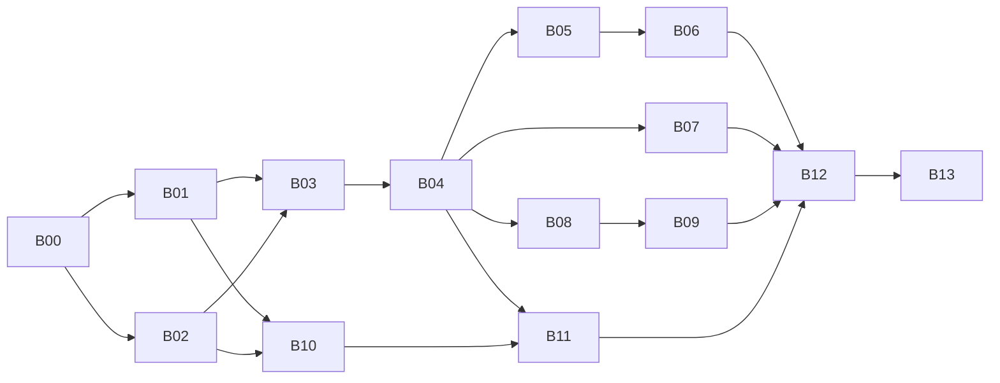

# 下一代 A.E.B. / AstrEX 施工包

原版编制：2026-09-25。更新：2026-10-02。本文件保留原施工包的批次与历史依赖；当前状态以下节为准。原 Windows 交付目录属于历史信息。

## 0. 同步与后续本地开发的当前状态（2026-10-02）

2026-10-01 的同步阶段仅同步固定 AstrBotEX `c9624a4`、运行已有验证和更新计划，**该阶段没有开发 B08/B09/B11、Laya、机械臂或微调**。历史报告保留。后续按单独授权完成 B04 最小边界修正、B07 Laya EX 后端接入，并实施 B08 源码；B09、机器人控制端和微调仍待开发。不 commit、不 push，已有暂存内容保持不变。

同步阶段完整回归首轮 476 项：470 通过、1 失败、5 项 ROS 环境错误；加入已有系统依赖后，5 项 ROS 原生通信定向重跑全部通过。停止状态断言失败保留，不能改写成全量 PASS。见[同步验证报告](../ASTRBOTEX_SYNC_20261001_RESULT.md)。

后续 B08 定向回归 199/199、边界检查 7/7、特殊字符脱敏 1/1、Chrome 检查 7/7 通过。一次真实 GPU HTTP 管理闭环通过，完成隔离测试 Actor 执行、写出后超时隔离及显式进程恢复；不代表机器人成功。见 [B08 结果](../B08_DECISION_MANAGEMENT_RESULT.md)。新增管理/Jev secret 受保护；旧 WebSocket token 未迁移，受鉴权旧 GET/ZIP 仍可能含该值。

| 范围 | 当前源码/验证状态 | 派工含义 |
|---|---|---|
| B00/B01/B02 | 合同、观测说明支持、SDK/账本/定向调度在固定提交中 | 复用已有代码；不从历史任务书重建 |
| B03 | 工程模拟插件在独立 EXplugin；本次没有导入 | 不假定本地已有完整工程闭环 |
| B04 | Goal/观测/生命周期接线已有；后续公开停止回执和可信 replace_backend 已实现 | 复用 requested/running/proven/failed 与匹配证明；历史停止断言失败保留 |
| B05/B06 | 完整 A.E.B. Goal/反馈/公开回复隔离接线未导入 | 首轮脚本提交正式 Goal，不阻塞机械臂局部验证 |
| B07 | Mock/Jev/Laya 已注册；Laya 是 EX 后端，GET /health probe 已有；Jev execute 被禁止 | 普通 Laya shadow only；execute 仅可信隔离测试 Actor；保留 Laya replan 0/8，不能宣称机器人质量 |
| B08 | 管理 API、定向/API/Chrome 与一次真实 GPU HTTP 管理闭环通过 | 复用已有 API、自有 Laya 管理和有界追踪；不重建第二套管理系统 |
| B09 | 一级决策页面仍待开发；旧页面仅完成鉴权兼容 | 依据 B08 实现接口单独派工，不绕过执行与停止边界 |
| B10 | 新 YOLO/目标绑定仍属独立计划 | MVP 先用已知物体 RGB/几何；保留目标引用规则 |
| B11 | 原生 ROS 通信已测；机器人执行/停止仍待开发 | 对应移动方案项目 R，同一份执行适配，不重复派工 |
| B12/B13 | Docker/ARM64/实物集成未开展 | 不纳入当前桌面 Isaac MVP 必经路径 |

### 当前最小派工链（B08 已完成，其余按下述范围待开发）

`B08 → B09`；`A 单臂基线 ↔ R ROS 执行 → L 原始 Laya 实际闭环 → T 小微调 → M 移动 GUI`。

B08/B09 不阻塞底层规划器开发；最终页面与动作账本、控制端 details 集成。A/R 共用一次物理基线；L/R 共用一次模型闭环验收。机器人项目的详细步骤、输入输出、故障矩阵和人工介入点集中在[移动机械臂方案](../MOBILE_MANIPULATION_PYROKI_MVP_PLAN.md)。

已确定本机或 SSH 隧道管理、xArm6/夹爪、差速等效底盘、RGB＋2D 和一次小规模微调。Laya 先作为 EX 决策后端接入；移动方案中的独立控制端轨迹评分仍待开发与验证，不能合并为已完成。B04 公开停止和可信切换前置已补齐。本轮无新增阻塞；旧 WebSocket token 迁移和模型 replan 质量另行安排。

下文总工期和原 M1–M4 属于完整历史施工包估算，**不是本轮同步任务或轻量移动 MVP 的承诺**。后续真实执行以本节和更新后的 B08/B09/B11 为准。

## 1. 已锁定的用户要求

1. LLM 负责长任务拆分、当前步骤选择、英文 goal、语义参数 JSON、基于失败反馈重新规划。
2. A.E.B. 保存步骤队列和任务状态；EX 只执行一个当前 goal。新 goal 必须使旧决策失效，并安全终止被替代动作。
3. Jev 和当前接入的 Laya 均为 EX 核心决策服务后端，**不是 EX 插件**。后端替换不修改插件业务接口；未来控制端轨迹评分属于另一项能力。
4. EX Dashboard 新增一级“决策”页面，与插件、运行日志、环境等页面并列。配置接入、查看当前 LLM goal、真正送入决策后端的输入、选项、结果与执行状态。
5. 决策服务通过核心动作调度器直接向目标插件下发明确命令；控制命令、确认、终态不依赖 TopicBus 的易丢失消息队列。
6. 感知插件自带一份简短的字段说明；原始 JSON 和说明同时可供 LLM / Jev 使用，不强制转换成统一业务感知 schema。
7. 内部 goal / 参数 / 反馈不进入 TTS 或 NapCat；公开自然语言可有可无，由 LLM 明确选择发送。
8. 旧硬件插件废弃。新 YOLO、新控制插件独立建设，不复活旧插件。

## 2. 阅读顺序

先读 [详细架构](01_下一代详细架构与现有代码对照.md)，再读 B00。施工人员只领取一个批次，按该批次依赖阅读相关规范。

| 批次 | 风险 | 具体作用 | 前置批次 | 建议执行者 | 估计人日 |
|---|---|---|---|---|---|
| [B00](B00_高风险_基线冻结与跨端协议定稿.md) | 高 | 冻结跨端消息、插件动作 SDK、状态和验收契约 | 架构评审 | 强 agent + 人审 | 2–3 |
| [B01](B01_低风险_插件小说明与测试样例.md) | 低 | 写感知说明、合法/非法样例、测试数据 | B00 | 弱 agent 可独立 | 1–2 |
| [B02](B02_高风险_EX直达插件命令通道与动作SDK.md) | 高 | 定向邮箱、动作注册、执行账本、取消和安全门禁 | B00 | 强 agent | 5–8 |
| [B03](B03_低风险_模拟感知与模拟执行插件.md) | 低 | 无硬件、确定性的模拟闭环 | B01、B02 | 弱 agent；SDK 已冻结 | 2–3 |
| [B04](B04_高风险_EX活动Goal与决策核心.md) | 高 | 当前 goal、代次隔离、异步调度、模型无关接口 | B02、B03 | 强 agent | 4–6 |
| [B05](B05_高风险_AEB任务规划缓存与反馈闭环.md) | 高 | 步骤队列、规划 skill、结果同步、重规划 | B00、B04 | 强 agent | 4–6 |
| [B06](B06_高风险_隐式控制与公开回复隔离.md) | 高 | 静默执行、用户路由、TTS/NapCat 隔离 | B05 | 强 agent | 2–4 |
| [B07](B07_高风险_Jev后端接入与决策评测.md) | 高 | Jev 适配、候选选择、限流、失效处理、效果评测 | B04、B01 | 强 agent | 3–5 |
| [B08](B08_高风险_决策管理API与密钥保护.md) | 高 | 决策配置、状态、输入追踪、密钥与存档边界 | B04；真接入测试需 B07 | 强 agent | 3–5 |
| [B09](B09_低风险_决策前端页面与展示.md) | 低 | 一级页面、表单、goal/选项/结果展示 | B08 接口冻结 | 弱 agent；安全逻辑禁止自行设计 | 2–4 |
| [B10](B10_高风险_新YOLO感知与目标参数绑定.md) | 高 | 新视觉插件、bbox/帧关联、选中目标验证 | B01、B02；端到端需 B05 | 强 agent | 4–7 |
| [B11](B11_高风险_ROS2执行插件与安全停止.md) | 高 | 新 ROS2 执行接口、业务 ACK、取消、看门狗 | B02、B04、B10 的目标契约 | 强 agent + 设备负责人 | 5–9 |
| [B12](B12_低风险_Docker回归与证据采集.md) | 低 | 执行冻结测试矩阵、收集证据、定位失败 | B03–B11 | 弱 agent；只运行及补测试驱动 | 2–4 |
| [B13](B13_高风险_香橙派集成与最终验收.md) | 高 | arm64/ROS2、故障注入、发布与回滚演练 | B12 | 强 agent + 人审 | 3–5 |

总计约 **42–71 人日**，是工程判断，不是承诺。单人约 9–15 工作周；冻结接口后可并行，仍需集成与评审。相比早期粗估，新增了直达动作 SDK、可靠状态恢复、决策管理页及跨架构验收，范围明显增大。真实机械臂标定、抓取规划、底盘控制器调参和真实相机算法优化另估；不能把“ROS2 上有消息”当成完整机器人已交付。

## 3. 依赖与里程碑

- M1：B00–B04，模拟插件通过直达接口完成当前 goal，无需真实模型。
- M2：B05–B07，LLM 分步规划、Jev 选择、失败反馈、可静默交流闭环。
- M3：B08–B11，决策页、新 YOLO、ROS2 模拟执行端集成。
- M4：B12–B13，Docker + 香橙派证据完备。实物执行资格单独签字。

## 4. 派工与变更规则

- 低风险不是“随便改”。弱 agent 只能改批次白名单；不得改安全阈值、协议、核心锁、状态机、鉴权、模型判定标准。
- 每批提交必须包含：改动文件、对应需求、测试命令及原始输出、失败/跳过原因、回滚方式。不能只给“测试通过”的文字。
- 需要变更 B00 契约时，暂停依赖该接口的批次，由强 agent 更新契约、双方测试后再继续。禁止两边各写一版协议。
- 现有工作区修改属于用户；不得 reset/checkout 覆盖。旧施工包曾记录 AEB 的文档/缓存变化；本轮以同步报告的实际快照为准，禁止套用旧 dirty 状态。
- 高风险合入需第二次独立检查：取消是否真的停止、旧结果是否能串入、模型是否越权、内部消息是否泄露。
- 本包所有“新增文件”“新增 API”“测试名”都是施工目标；未标明“现有”的不要当作已存在。
- 各批测试名采用建议名称，可按仓库风格调整，但需求 ID、场景、断言不得缩水。

## 5. 测试边界

原施工包只做只读检查。2026-10-01 的同步更新额外同步了 AstrBotEX 固定上游源码并运行既有测试；该阶段未开发新功能、未调用真实 Jev、未部署香橙派、未驱动硬件或 Isaac 机器人。后续本地开发已实施 B04 最小修正、B07 Laya 和 B08 管理代码；未实施 B09、ROS/Isaac 控制或微调。验证范围与待实测项以第 0 节为准。

最终结论与填写规则见 [99_最终验收报告_待实施待实测.md](99_最终验收报告_待实施待实测.md)。该文件保留详细验收报告的历史底稿；未因本轮 B08 定向测试改写机器人、跨端或整体 MVP 的待测状态。当前已实施范围以本节和 B08 实现说明为准。
