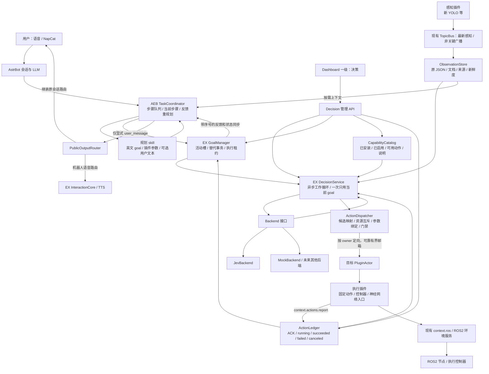
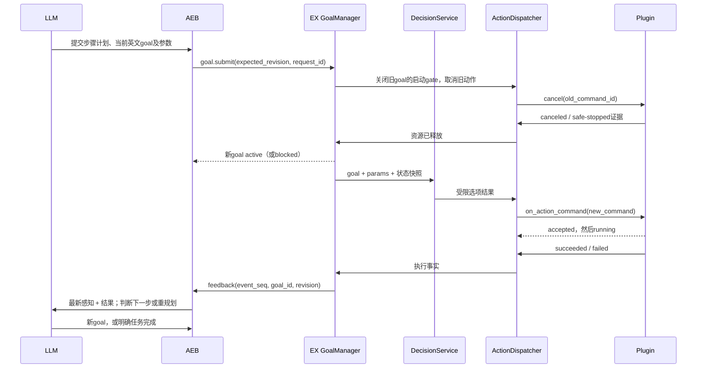

# 下一代 A.E.B. / AstrEX 详细架构

版本：设计 v1，2026-09-25。本文是施工目标；源码事实与拟新增能力明确分开。

## 1. 核心决策

LLM 决定“下一步要完成什么、语义参数是什么”；Jev 决定“当前 goal 下各插件现在该做哪个已声明操作”；EX 决定“这个操作此刻是否允许、送给谁、是否收到、是否结束”；插件执行本地程序或控制器，报告事实结果。

**Jev 不做插件；不直接调用任意 Python 方法；不拥有硬件安全权限。** 它是 `DecisionService` 使用的一个可替换决策后端。所谓直达插件，是 EX 核心 `ActionDispatcher → 指定 PluginActor → 标准命令接口`，不是 HTTP 模型线程直接碰插件对象。

## 2. 系统总图



不支持 Mermaid 的阅读器可按这个主链阅读：

`LLM → AEB任务协调 → 当前goal → 决策后端选项 → EX动作调度器 → 插件 → 执行账本 → AEB反馈 → LLM`。

并行旁路：`LLM公开消息 → 原会话 / TTS`；`感知插件 → TopicBus → 观测快照 → LLM和决策后端`。

## 3. 与现有系统的逐项对照

以下路径分别相对 `D:\Code\AstrBotEX`（EX）、`D:\Code\A.E.B\astrbot_plugin_astrbotex_interaction`（AEB）、`D:\Code\AstrBot-latest`（Host）。函数名是定位依据，行号随施工变化。

| 当前模块与源码事实 | 保留什么 | 新增/修改什么 | 批次 |
|---|---|---|---|
| EX `core/runtime.py`：`_select_goal()` 调 policy；只持有单个 `active_skill` | runtime 生命周期、基础感知、现有本地规则 | 新决策模式使用 GoalManager + DecisionService；旧 policy 不得与新调度器并行控制同一资源 | B04 |
| EX `core/api_server.py`：`RuntimeController._tick_loop()` 在锁内调用 tick，默认 20Hz | 控制入口、状态、组合根 | 云请求与长操作移出 tick/锁；组装决策服务；停机关闭动作 gate | B04/B08 |
| EX `core/astrbot_bridge.py`：context、affordances、参数和 owner 校验 | 已有合法动作检查思路、上下文入口 | 追加 goal 协议；新模式禁旧 proposal 直接驱动；执行时重验观测年龄 | B02/B04 |
| 同文件 `_execute()`：向 topic 发布，返回 `published` | 旧模式兼容入口暂留 | 新动作走直达 Dispatcher，返回 admission / command_id；不能冒充执行完成 | B02 |
| 同文件 `_validate_block_refs()`：检查缓存中的 `fresh` | block 引用概念 | 以当前单调时钟重算新鲜度；缓存建好时 fresh 不代表现在 fresh | B02/B04 |
| 同文件 `_validate_value()`：只有基本类型、required、enum与递归检查 | 基础校验用例 | 新动作严格处理additionalProperties、数值/长度/数组边界、非有限值；不能声称旧代码已完整实现JSON Schema | B00/B02 |
| EX `core/topic_bus.py`：latest、recent、有界 inbox；满时丢旧；同步调用 callback | 感知最新值和非关键展示广播 | 不把它改造成可靠控制总线。观测服务只用短回调，账本/命令独立 | B02/B04 |
| EX `core/plugin_actor.py`：单工作线程，普通 mailbox 无界；`call()` 默认等 2s | 插件单线程约束、既有生命周期 | 新动作专用有界定向队列，取消/停止优先槽；插件短回调 + 自身 worker推进 | B02 |
| EX `core/plugin_registry.py`：按 plugin_id 可 `get()`，有 enable/disable/lifecycle | 按 owner 查实例 | 动作目录注册/注销、实例 generation、卸载前撤销动作；不要按 capability 随机选插件 | B02 |
| EX `core/local_plugins.py`：`ActionDeclaration` 必须有 topic；`PluginContext` 有 topic_bus/ros | 插件发现、配置、ROS facade | 新动作版本声明、小说明读取、`context.actions`，新版本动作 topic 可省略 | B02 |
| EX `core/environments/*`：ROS 端口、绑定/环境代次、quiesce、有限停止授权 | 整套基础设施 | 与 goal/动作代次联动；不重造第二套 ROS 生命周期；补业务 ACK | B04/B11 |
| EX `core/connection_manager.py`：ZMQ request/reply 和业务路由 | 8766/8767/8768 三通道 | text 增 goal、feedback、sync；进程重连通过快照补账，不依赖一次 event | B05 |
| AEB `main.py`：工具、上下文注入、三通道、视觉缓存 | 平台适配、STT/TTS、缓冲和传输 | 增任务协调器、私有规划工具、反馈处理、会话权限 | B05/B06 |
| AEB `main.py::forward_reply()`：普通文本转为 `interaction.reply` | 原会话/turn/generation 路由 | 内部规划不进入普通 event 自动回复；仅公开出口可转发 | B06 |
| EX `core/interaction_core.py`：回复文本可进入 TTS；有语音 generation | 语音打断与音频流 | 公开消息标记/路由验证、旧任务话术抑制；不让内部消息被朗读 | B06 |
| Host `core/star/context.py`：有 `llm_generate`、`tool_loop_agent`；后者要求最终 response | 公共 LLM/tool API | 优先 AEB 私有规划循环；不能假设工具-only回合已天然支持；Host 修改仅最小兼容补丁 | B05/B06 |
| Host `core/skills/skill_manager.py`：可发现插件 skills 目录 | skill 发现机制 | AEB 新规划 skill；私有规划调用显式加载关键指令，不能假设所有调用自动注入 | B05 |
| EX `dashboard/index.html/app.js/environments.js/styles.css`：已有一级导航/hash/SSE/草稿保护 | 布局和刷新风格 | 新 `decision.js`、`#/decision`、一级“决策”；不放进插件分类页 | B09 |
| EX `core/backup.py`：存档 roots 为 profiles/plugins | 现有快照机制 | 新配置可存档但 secret 不进包；恢复先停机并失效旧 goal | B08 |

已有 `decision` 插件分类不等于新的一级“决策”页面，也不代表 Jev 应注册成该分类插件。

## 4. 核心服务和文件布局建议

```text
EX/astrbot_ex/core/decision/
  models.py          # Goal、Candidate、DecisionSnapshot 等轻量数据类型
  goal_manager.py    # 当前goal与替代事务
  catalog.py         # 从已加载插件生成候选能力目录
  observations.py    # JSON、小说明、来源/接收年龄、快照
  service.py         # 后端无关的异步调度循环
  backends/base.py   # 固定后端接口
  backends/mock.py   # 确定性测试后端
  backends/jev.py    # Jev API映射，仅此文件知道供应商协议
  config.py          # 配置校验、revision、secret引用
EX/astrbot_ex/core/actions/
  models.py          # 命令、回执、终态
  dispatcher.py      # owner定向/资源门禁/幂等
  ledger.py          # 执行状态、事件序号、可查询结果
AEB/
  task_models.py, task_store.py, task_coordinator.py
  planning_tools.py, output_router.py
  skills/robot_task_planning/SKILL.md
EX/dashboard/decision.js
```

仅建议职责边界；小模块可以合并，不为文件数量而抽象。模型 SDK 不侵入 runtime、插件或前端。

## 5. 插件如何被 Jev 认识

### 5.1 新插件开发要求

| 插件提供的材料 | 谁使用 | 必须包含 |
|---|---|---|
| 感知 `output_description.md` | LLM + 决策后端 | 每个 JSON 字段含义、单位、坐标系、空值、时效、示例；建议英文或中英对照 |
| manifest 中动作声明 | Catalog + LLM + 后端 | 稳定 action_id、英文用途、参数约束、资源、可执行状态、取消/暂停能力、最长时限 |
| 标准命令入口 | Dispatcher | `on_action_command(command)`，短时受理或拒绝，不等待物理动作完成 |
| 取消入口与本地推进 | Actor / worker | `on_action_cancel(command_id, reason)`，worker持续推进；可暂停才声明暂停 |
| 异步结果上报 | Ledger | `context.actions.report(command_id, status, details)`；owner由上下文绑定 |
| 本地安全机制 | 插件/下位机 | 租约/传感器失效停车、停止回执、运行时/环境停机钩子 |

感知说明是插件自己的“小文档”，不是另造通用感知 DSL。必须有少量共同的**外层来源与时间元数据**，但不统一 payload 的业务字段。动作参数是执行契约，仍需可校验的参数 schema；两者不要混淆。

### 5.2 目录、候选项和实际投递

1. PluginManager 加载插件 → Catalog 注册 owner、插件实例代次、动作声明和小说明版本。
2. 每轮 EX 读取当前 goal、绑定参数、插件状态、观测年龄、资源占用。
3. **代码先过滤**未加载、未启用、无参数、传感器失效、资源冲突、环境不匹配等动作。
4. 为每个当前参与调度的插件形成有限选项：`keep`、`start:<action_id>`、`cancel:<command_id>`，以及 `wait` / `request_replan`。只有声明支持时才出现 pause/resume。
5. 每个选项带人能读懂的用途与前置条件。后端看见的不是孤立数字；返回稳定 option_id，不返回函数名或新参数。
6. 一次请求可以对多个 owner 提问，但返回是各自独立的判断。EX 统一仲裁资源；不把独立选择当成天然一致的联合计划。
7. 通过仲裁后按 `owner + plugin_generation` 投递到准确 Actor；Jev 不知道也不决定底层 topic、ROS topic、IP 或 Python handler。
8. 插件卸载、重载、配置/动作目录变化、环境切换时提升 revision。所有旧候选映射失效，重新构造快照。

LLM可查询完整目录；决策快照可附所有已启用插件的短摘要，但只展开与当前goal相关的可执行候选与感知说明。未参与的插件标明不可调度原因，不让模型误以为某个插件不存在，也不把全系统历史塞进每轮请求。

示例：YOLO 有 `detect.start/detect.pause`；底盘有 `forward/turn_left/stop`；机械臂有 `pick_selected`。LLM 可绑定机械臂目标，但它不代替 Jev 调用 `pick_selected`。新 goal 只是授权和意图，实际何时启动仍经 Jev + EX 门禁。

管理上的“启用/禁用插件”与任务中的“开始检测/暂停检测”必须分离。Jev 调度已获管理员启用的插件工作模式，默认不能安装、卸载、偷偷启用硬件插件。

## 6. 为什么控制链路跳出 TopicBus

| 数据 | 主通道 | 保证 |
|---|---|---|
| 连续感知 JSON | 现有 TopicBus → ObservationStore | 最新优先，允许丢中间帧；接收时记录本地时间、大小和来源 |
| 决策候选目录 | Catalog 内存只读快照 | 与 revision 固定绑定 |
| 新动作/取消命令 | Dispatcher → Actor 专用邮箱 | 单 owner、有限容量、满则明确拒绝；不丢旧命令腾位 |
| ACK/进度/终态 | 插件 `context.actions.report` → Ledger | 原子状态变更；终态不可被 progress 覆盖；查询可恢复 |
| 用户层任务反馈 | Ledger/GoalManager → AEB 的 ZMQ 请求 + sync | 带 event_seq、ACK 和重放；丢提示不等于丢事实 |
| Dashboard 日志 | EventBus/SSE + HTTP快照 | SSE 可以只提示刷新；页面不能作为状态真相 |

保留 TopicBus 原语义和旧测试，不用整套消息中间件替换它。动作通信是 EX 进程内可靠接口，不要求起额外服务器。

普通 actor `call()` 是同步等待，`cast()` 的邮箱无界，两者都不能不加改造就直接当新控制通道。B02 给动作增加容量限制与停止优先通道，生命周期旧入口保持兼容。取消可插队待处理工作，但**不能抢占正在执行的 Python 回调**；长计算必须交给 worker/受控子进程，本地看门狗与硬件急停不依赖 actor及时返回。

保证语义是“同一 command_id 不重复开始 + 状态可核对”，不是跨崩溃物理 exactly-once。崩溃后未确认执行结果记 `unknown`，先停机/核对，不能盲目重新抓取。

## 7. goal、参数与反馈闭环



- AEB 是计划队列的唯一所有者，EX 是当前活动 goal 和动作事实的唯一所有者。
- 同一机器人一期只允许一个任务持有控制权。其他会话可查询；抢占需明确授权，不靠“最后一个消息覆盖一切”。
- 一份 goal 和其参数作为一个不可拆分的 revision 提交，禁止 goal 已更新、参数仍旧版本。
- 替代时旧 goal 立即不再产生新动作；旧动作进入取消状态。新 goal 在安全停止确认后才 active。取消失败则 blocked，不假装已切换。
- 动作 succeeded 不自动等于 goal succeeded：GoalManager 根据声明的证据条件形成 `completion_evidence`；LLM 确认推进下一步。Jev 不判定高层任务完成，不推进步骤。
- 失败、超时、参数缺失先本地安全停住，再反馈给 LLM。允许本地预声明的有限硬件重试，但不得偷偷改变高层目标。
- 未来步骤只缓存意图和所需参数类型；bbox、位置等在临执行时取新感知，不能把长任务开始时的框一路用到底。

## 8. 三种代次与时钟

- `goal_revision`：目标与参数替换；AEB带 expected_revision，EX负责接受后的递增。
- `decision_config_revision / catalog_revision / plugin_generation`：模型配置、选项集合或插件实例变化。
- `environment_session/generation/binding_revision`：沿用现有 ROS2 代际；不能拿语音 `generation` 代替。
- `ex_session`：EX 每次启动更换；防止重启前的网络回复重新驱动。

后端请求绑定上述必要版本、snapshot_id、观测序号与构造时刻。返回时重新验证。实际投递和 ROS 输出前还要验证本地 gate。

TTL 和租约用接收端单调时钟。跨机器发送 `ttl_ms` 和 ID，不比较两台机器的 monotonic 数值。采集时间只是额外诊断；未来时间戳、缺时间、缺来源不得默认新鲜。

## 9. 决策页面与后端替换

```text
一级导航：核心 | 插件 | 运行日志 | 语音 | 连接 | 环境 | 决策 | 存档

决策
 ├─ 后端配置：类型、模型、服务地址、密钥(只写)、超时、最大频率
 ├─ 工作模式：关闭 / 影子评估 / 执行；测试连接独立按钮
 ├─ 当前任务：task_id、goal_id、revision、状态、绑定参数、来源会话摘要
 ├─ LLM下发原文：当前真正生效的英文goal；待替代goal另列
 ├─ 本轮决策输入：固定规则、LLM goal、说明+感知快照、候选选项
 ├─ 决策结果：各插件的选项、confidence、耗时、是否被EX拒绝及理由
 └─ 执行状态：command_id、受理/运行/终态、取消/租约、最近失败
```

“提示词”不是 LLM 隐藏推理。显示 LLM 正式下发的 goal 与真实发送给后端的 instructions/state/criteria；必须带 snapshot_id，避免显示草稿却称其为当前输入。

后端统一接口：`capabilities()`、`decide(snapshot)`、`healthcheck()`、`close()`。当前实现 `mock` 与 `jev`；未来后端由代码注册，前端从服务端拿字段定义/能力。不能凭一个任意 URL 宣称“兼容所有模型”，不做远程代码加载。

保存配置不自动启用执行。连接测试不借用真实 goal、不驱动插件。切换模型先停止/排空旧请求，revision提升；未通过验证的后端只能关闭或影子模式。

密钥由后端持有，页面只知道 configured=true/false。密钥文件放在快照 roots之外；HTTP返回、日志、SSE、导出与浏览器存储不得包含密钥。远程管理需已有可信访问边界/HTTPS代理；本次未完成现有API鉴权专项审计，不能默认公开互联网安全。

## 10. 隐式控制与公开自然语言

AEB私有规划循环读取 skill、观察和反馈，只可用计划/参数/结束回合/可选发言工具。它的普通生成文本默认不转发到聊天平台，显式 `user_message` 才交给 PublicOutputRouter。普通闲聊保留原聊天行为，不把每句聊天变成机器人任务。

公开出口不允许模型填写任意收件人；继承已授权会话路由。`user_message_id` 去重与 `command_id` 去重分离。工具调用和工具结果不流式播放；TTS失败不得重试机械动作。执行未确认只能说准备/尝试，不能宣称成功。

## 11. Jev 可行性与尚未证明之处

2026-09-25核对官方资料：当前稳定版本 `jev-1.13.0`；文本/JSON输入，无图像音频；英文表现最佳；Choice返回有限选项、分布和confidence，每题最多255项；同请求问题独立。方案依赖这些能力，不依赖它生成参数或记住上轮状态。[模型](https://docs.typesafe.ai/models)、[Choice](https://docs.typesafe.ai/primitives/choice)、[状态](https://docs.typesafe.ai/concepts/state)。

官方明确列出数值比较、无关长上下文、对抗输入、生成文本等短板。因此 TTL、资源互斥、几何运算和安全限制全部在代码/控制器处理；插件文档不是可越权的系统指令。[已知局限](https://docs.typesafe.ai/model-jaggedness/jev-1.13)。

Text2Motion 可作为“语言规划与低层可执行性分工”的研究背景，但不能证明本系统或 Jev 已具备抓取规划和实体安全能力。[论文](https://arxiv.org/abs/2303.12153)。

价值假设：降低持续调度的LLM调用次数，让控制状态和用户话术解耦、插件接口明确。最终是否优于纯LLM方案，须 B07 以相同场景比较成功率、延迟、成本及失败恢复；不能预先写成已证明。

## 12. 不纳入一期的扩张

不做多机器人联合规划；不做通用工作流平台；不做万能插件自动安装；不重写ROS2环境层；不把所有感知JSON转通用世界模型；不声称云端决策是硬实时控制；不声称2D bbox即可驱动机械臂完成安全抓取。
