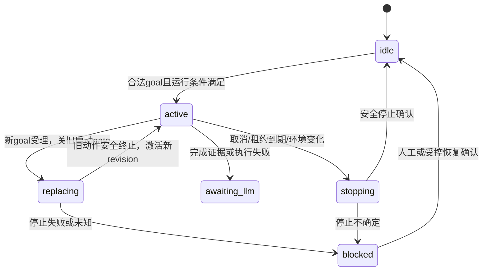

# B04｜高风险｜EX活动Goal与决策核心

作用：让EX拥有独立于任何模型的活动goal槽、调度循环、候选快照和安全替代机制。预计4–6人日。依赖B02/B03。

## 1. 修改地图

- 新增 `core/decision/goal_manager.py`、`observations.py`、`service.py`、`backends/base.py`、`backends/mock.py`。
- 修改 `core/runtime.py`：新模式不再由policy插件选择高层goal；保留生命周期、感知与本地安全。
- 修改 `core/api_server.py::build_server/RuntimeController`：组装服务，注册状态；网络等待不得进入tick锁。
- 修改 `core/environments/manager.py` 的集成钩子：环境切换开始就阻止新动作；保留现有quiesce授权，不另造ROS生命周期。
- 连接B02 Catalog/Dispatcher/Ledger；不使用旧`active_skill`充当多插件动作状态表。

## 2. 状态所有权

GoalManager持有一个 `active` 和至多一个 `pending_replace`。历史用于诊断，不能被决策执行。计划队列属于AEB，EX不缓存可自动推进的全部步骤。

`awaiting_llm`不能让Jev另选一个高层goal。完成条件由代码可验证的动作证据形成，再交LLM推进；纯语义任务也必须有受控的LLM确认结果，而不是由Jev随意宣布完成。

## 3. 施工步骤与验收

| 步骤 | 工作 | 本步完成条件 |
|---|---|---|
| 1 | GoalSubmit原子验证与revision CAS；参数与goal一起提交 | 竞争提交只一个成功；失败不改变活动参数 |
| 2 | 新goal使旧决策token失效；进入取消旧动作阶段 | 旧请求晚返回永不下发；新goal不抢未释放资源 |
| 3 | ObservationStore订阅声明感知，保存接收单调时刻/来源/序号/原JSON/说明hash | 不改payload业务结构；缺帧、旧帧、源重启可分辨 |
| 4 | 构造相关插件目录与每owner的候选；代码先过滤硬条件 | 模型看不到当下不合法start；stop/wait总有有效表达 |
| 5 | 定义Backend接口、实现确定性MockBackend | 不依赖JevSDK；可回放每个decision_id |
| 6 | 异步决策worker，最多一个live请求；观察更新合并、按最大频率触发 | 输入洪水不创建无限future；tick/status/stop不等云请求 |
| 7 | 返回后二次验证版本、观测年龄、资源和参数 | 配置/插件/环境变化后结果丢弃并记录原因 |
| 8 | 多owner结果统一仲裁再提交Dispatcher | 同轮独立选择冲突时不双占；不能假设问题间有协同 |
| 9 | 续租、失败退避、任务超时、控制权丢失 | AEB断开后动作按租约停；错误不会忙循环重调模型 |
| 10 | stop/fault/pause/unload/restore/环境切换全路径联动 | 关gate→取消→确认；恢复后需重新授权，不能自启动 |

多owner不宣称跨硬件原子执行：先在EX预留互斥资源，逐条入队；部分插件拒绝则取消本轮已受理动作并报告部分执行，禁止把整体标成功。真正需要同步的联合动作应由一个复合执行插件提供单一action，由其控制器保证同步。

## 4. 时效、参数与候选细则

- 模型响应不能简单“取最新就用”：用的是该request自己的goal、catalog与options映射。
- 同一插件`keep`不重发start。取消后不能通过旧keep续命。
- bbox目标参数含观测ID、相机/追踪会话、frame/object标识；新帧映射由插件追踪或重新请求LLM选择，不默认为数组下标相同就是同一物体。
- 新观测与旧参数不匹配时，候选不含危险start，输出需要更新参数的结构化反馈。
- 可保留低层插件持续控制，不要求云端逐帧发速度；决策频率与本地控制频率分开。
- 原 `runtime.tick()` 中的感知/interaction更新存在提前return路径，重构时覆盖无goal/无motion/无skill情形，不能让无任务时交互和必要感知饿死。
- 当前TopicBus保存的是消息对象引用，不提供跨topic原子一致快照。ObservationStore在受控入口做有大小限制的不可变复制，记录每来源的seq/接收时间；组装快照时保留各自年龄，不能宣称不同传感器“同一时刻”。无法满足任务的时间差约束时过滤危险候选。
- 动作/结果账本每实例独立有界，已结束记录按保留策略裁剪；裁剪后去重语义通过session和幂等墓碑维持。不得为节省内存清掉仍可能重试的command_id后再次执行。

## 5. 测试与门槛

新增 `test_goal_manager.py`、`test_decision_service.py`、`test_observation_store.py`、`test_decision_runtime_integration.py`。回归 `test_runtime_actor_integration.py`、`test_environments.py`、`test_environment_boundaries.py`、`test_api_server.py`。

| ID | 场景 | 通过标准 |
|---|---|---|
| G01 | 同时提交两个expected_revision相同的新goal | 只激活一个；另一个明确冲突 |
| G02 | 连续100次goal替代，随机晚回模型结果 | 零旧goal动作；最终状态与最后受理goal一致 |
| G03 | 当前动作取消失败 | 新goal blocked；零新物理start；页面能见原因 |
| G04 | mock后端挂住10s | HTTP status继续可读；stop gate不等10s；本地租约有效 |
| G05 | 感知过期、未来时间、缺时间、数据源重启 | 均不被误判为可信新鲜数据 |
| G06 | 后端结果独立但争同资源 | 被仲裁，零双占；不自造新候选 |
| G07 | 插件/模型/ROS环境在请求中变化 | 旧结果拒绝，并显示具体revision冲突 |
| G08 | AEB离线/EX重启/存档恢复 | 自动执行计数=0，需恢复核对 |
| G09 | 无goal情况下聊天/感知/停止 | 仍可用；不会卡在旧policy逻辑 |
| G10 | 部分动作受理，另一动作拒绝 | 有部分执行事实，已启动项取消，不假装原子成功 |

模拟测试目标：关闭新动作gate在触发取消后的100ms内可观察；此值是测试环境目标，不是硬件停车保证。计时使用monotonic并报告平台和p95/max。逻辑测试虚拟时钟与真实异步响应测试分开。

通过：G01–G10全过，零跨代次下发；既有ROS/TopicBus行为无新增失败；所有后台任务关闭可回收。

## 6. 交接与回滚

交接B05/B07/B08统一的状态快照、MockBackend、失败注入和配置revision。默认关闭执行；回滚前显式stop并确认动作终态，禁自动切旧policy继续跑。
